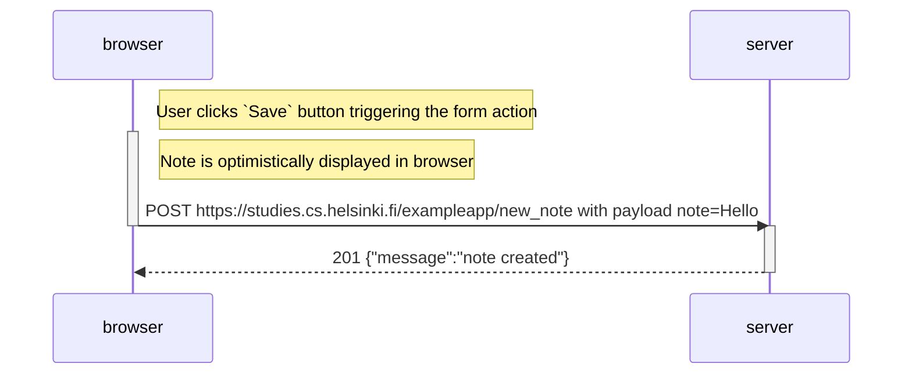

```mermaid
sequenceDiagram
    participant browser
    participant server
    
    Note right of browser: User clicks `Save` button triggering the form action
    activate browser
    Note right of browser: Note is optimistically displayed in browser

    browser->>server: POST https://studies.cs.helsinki.fi/exampleapp/new_note with payload note=Hello
    deactivate browser
    activate server  
    server-->>browser: 201 {"message":"note created"}
    deactivate server  

```